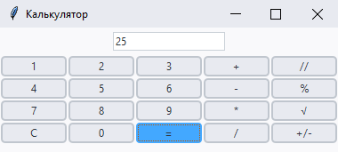

# Напишите GUI калькулятор, который:

1. Выполняет основные арифметические операции – сложение, вычитание, деление и умножение.
2. Поддерживает операции с отрицательными числами, извлечение квадратного корня, деление с остатком и целочисленное деление.
3. Кроме того, программа должна поддерживать очистку ввода.

Ожидаемый результат:

# Задание полегче:

Есть [файл](../Solutions/task1-solved.py) с решением приведенного выше задания, содержащий ошибку. Необходимо найти эту ошибку и исправить ее.
