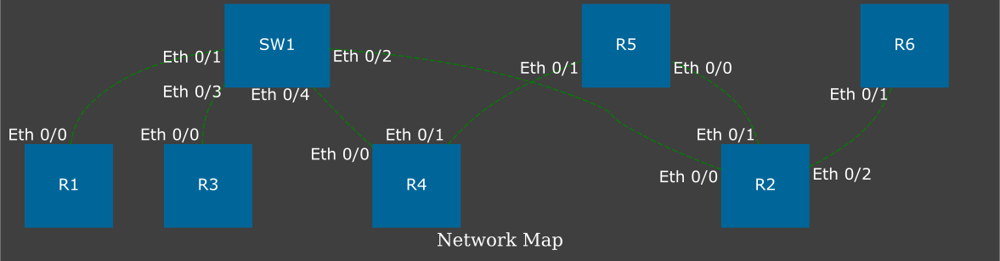

# Topology Drawer

Написать скрипт на ЯП Python, строящий топологию сети из вывода команды `show cdp neighbor`.

Скрипт ожидает на вход список файлов из которых надо считать вывод команды `show cdp neighbor`. Как передавать этот список - на выбор студента. Это может быть сделано через стандартный ввод, через аргументы при вызове программы, через отдельный файл, содержащий названия файлов и тд. Пример файлов с выводом команды `show cdp neighbor` [тут](./src/out).

Скрипт должен считать данные из списка файлов, распарсить данные и передать их в функцию визуализации - находится [тут](./src/draw_network_graph.py).

Результат выполнения скрипта должен выглядеть подобным образом:


Примечания:

* В каком формате должны быть переданы данные в [функцию визуализации](./src/draw_network_graph.py) - необходимо выяснить самостоятельно, проанализировав эту функцию.
* Для выполнения этого задания, должен быть установлен graphviz: [download](https://graphviz.org/download/). И модуль python для работы с graphviz: `pip install graphviz`.
* Скрипт должен не только менять формат представления топологии, но и удалять «дублирующиеся» соединения. Тут «дублирующиеся» соединения, это ситуация когда в словаре есть два соединения:

```json
("R1", "Eth0/0"): ("SW1", "Eth0/1")
("SW1", "Eth0/1"): ("R1", "Eth0/0")
```

Из-за того что один и тот же линк описывается дважды, на схеме будут лишние соединения. Задача оставить только один из этих линков в итоговом словаре, не важно какой.

* Проверить работу функции на файлах из [папки](./src/out)
* При желании, студент может написать собственную функцию визуализации (вместо [этой](./src/draw_network_graph.py)), но это необязательно.
* Справочные материалы находятся в этом же репозитории - [здесь](https://github.com/lapetitemort-repos/python_course/tree/main/lectures)
